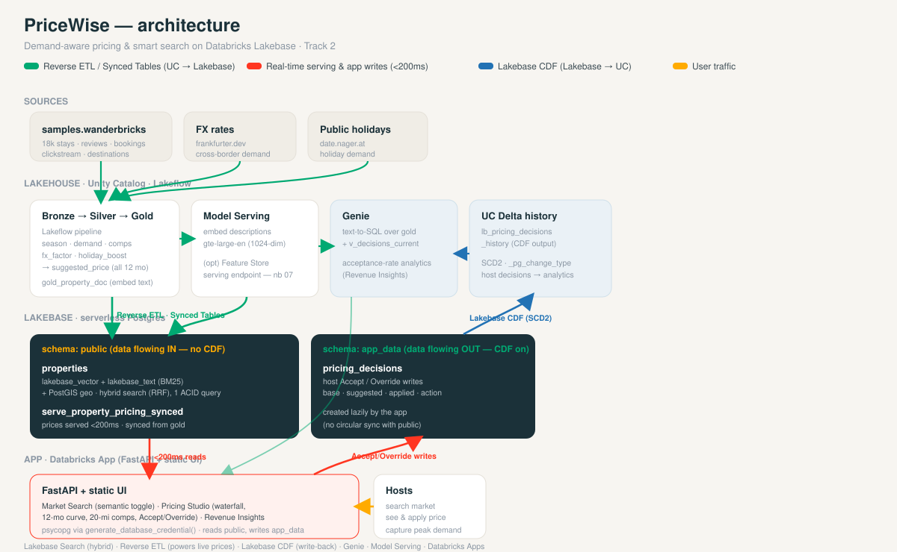

# PriceWise

Demand-aware dynamic pricing + smart search for a leisure-stay marketplace, built on **Databricks Lakebase**.
Track 2 (Data & ML Engineers) — DNB Lakebase Hackathon, Sept 2026.

> **The wedge (proven from data):** in this marketplace July books ~10× January, but the nightly
> price is flat all year. PriceWise closes that gap — serving a real-time, demand-aware suggested
> price from Lakebase and letting guests search stays in plain language.

See [`PROJECT_BRIEF.md`](./PROJECT_BRIEF.md) for the full concept, rubric fit, and demo script.


See [`docs/architecture.html`](./docs/architecture.html) for the animated version.

## Pillars (Track 2)
- **Lakebase Search** — hybrid `lakebase_vector` + `lakebase_text` (BM25) + structured filters via RRF, one ACID query.
- **Real-time pricing served from Lakebase** — suggested price served by `(property_id, month)` in <200ms directly from Lakebase (the app reads Postgres). Optional managed Feature Serving endpoint in `notebooks/07`.
- **Reverse ETL / Synced Tables** — gold features synced UC → Lakebase `public` schema (notebook 06; powers the live app prices).
- **Lakebase CDF** — app write-backs (`pricing_decisions`) replicated Lakebase → UC as Delta change history (notebook 09).

## Lakebase schema layout (why two schemas)
CDF is configured per-schema, so we separate the two data-flow directions to avoid a circular sync:
- **`public`** — tables flowing **IN** (UC → Postgres via Synced Tables): `properties`, `serve_property_pricing_synced`. **Not** captured by CDF.
- **`app_data`** — tables the app **writes** that flow **OUT** (Postgres → UC via CDF): `app_data.pricing_decisions`. CDF runs on `app_data` only.

`app_data.pricing_decisions` is created lazily by the app on first Accept/Override — see `_ensure_decisions_table()` in `app/server/queries.py` (`CREATE SCHEMA IF NOT EXISTS app_data` + `CREATE TABLE ...`). No separate migration.

## Data sources
- `samples.wanderbricks` — 18,163 properties, reviews, bookings, clickstream, destinations, amenities.
- FX rates — `frankfurter.dev` (ECB, no-auth) — cross-border demand signal.
- Public holidays — `date.nager.at` (no-auth) — holiday/school-break demand.

## Repo layout
```
pricewise/
  README.md                  # this file
  PROJECT_BRIEF.md           # concept, rubric fit, demo script
  databricks.yml             # Asset Bundle (jobs, pipeline, app) — TODO
  .env.example               # local dev config template
  requirements.txt           # python deps
  docs/
    architecture.html        # animated end-to-end pipeline diagram
  pipelines/                 # Lakeflow Declarative Pipeline (bronze->silver->gold)
    bronze/                  # raw source reads (wanderbricks, fx, holidays)
    silver/                  # cleaned/typed
    gold/                    # features: seasonality, demand, comps, fx, holidays + property doc
  ingest/                    # external source pulls (fx, holidays -> Delta)
  features/                  # feature engineering + online store publish
  embeddings/                # description embedding job (Model Serving)
  lakebase/                  # DDL, extensions, sync config
    sql/                     # schema.sql, extensions.sql, hybrid_search.sql, comps.sql
  app/                       # Databricks App (FastAPI + static UI)
    server/                  # FastAPI backend (routes, lakebase client)
    static/                  # HTML/CSS/JS frontend (tabs, search, pricing studio)
  genie/                     # Genie space config + Revenue Copilot (optional)
  scripts/                   # setup/smoke-test/deploy helpers
  notebooks/                 # exploratory / one-off Databricks notebooks
  tests/                     # smoke + query tests
```

## Quickstart (build order)
1. Provision Lakebase (`scripts/provision_lakebase.py`) + run extension smoke test.
2. Ingest FX + holidays to Delta (`ingest/`).
3. Build gold features (`pipelines/gold/`).
4. Embed descriptions + create Lakebase indexes (`embeddings/`, `lakebase/sql/`).
5. Reverse ETL gold → Lakebase (`features/`, Synced Tables).
6. Run the app locally (`app/server`), then deploy via Asset Bundle (`databricks.yml`).

## Workspace
- Team schema: `hackathon.data_axle` · Warehouse: `hackathon-shared-small` (`64d934278b5c472d`)
- Host: `dbc-9d25a17d-f58c.cloud.databricks.com` (dnb-hackathon-west-1)
